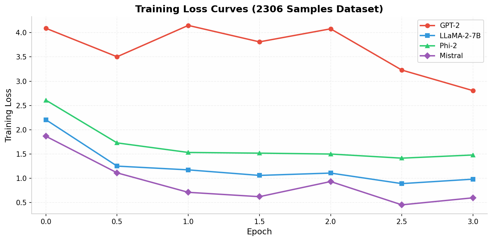
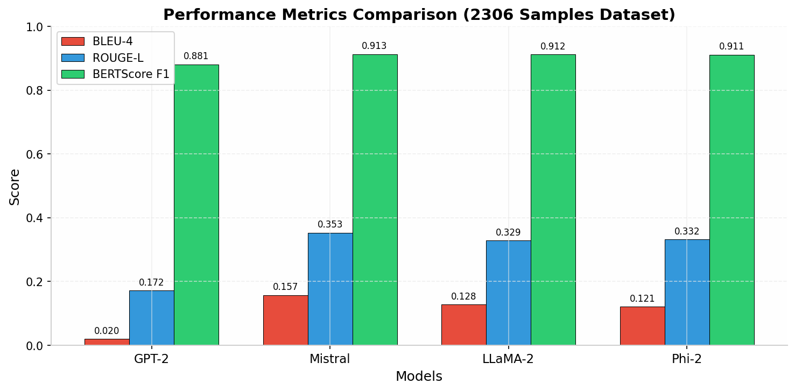

# Fine-Tuning Transformer Models for Technical Interview Question Answering

[](main.pdf)
[](LICENSE)
[](https://www.python.org/)
[](https://pytorch.org/)

A comprehensive study on fine-tuning Large Language Models (LLMs) for technical interview question answering across core Computer Science domains.

## 📋 Table of Contents

- [Overview](#overview)
- [Dataset](#dataset)
- [Models](#models)
- [Methodology](#methodology)
- [Results](#results)
- [Installation](#installation)
- [Usage](#usage)

## 🎯 Overview

This project presents a systematic evaluation of fine-tuning transformer models for generating accurate responses to technical interview questions. We constructed a dataset of **2,306 question-answer pairs** covering:

- 📊 Data Structures
- ⚡ Algorithms
- 🖥️ Operating Systems
- 🗄️ Databases
- 🌐 Computer Networks

Our experiments compare four prominent transformer architectures fine-tuned using **LoRA (Low-Rank Adaptation)** across three dataset sizes (200, 1,000, and 2,306 samples).

## 📊 Dataset

### Construction Process

| Stage | Description | Output |
|-------|-------------|--------|
| **Seed Curation** | Manual curation from technical interview resources and textbooks | 200 high-quality Q&A pairs |
| **Synthetic Expansion** | Generated variations using Qwen3.5-plus | ~2,300 total samples |

### Preprocessing Pipeline

```
Original Dataset (3,070 samples)
    ↓
Exact Deduplication (-414 duplicates)
    ↓
2,656 unique samples
    ↓
Semantic Deduplication (-350 near-duplicates, similarity > 0.90)
    ↓
Final Dataset (2,306 samples)
```

**Semantic deduplication** uses MiniLM-L6-v2 embeddings with cosine similarity threshold of 0.90.

### Dataset Statistics

| Dataset Size | Training | Testing | Total |
|--------------|----------|---------|-------|
| Small | 180 | 20 | 200 |
| Medium | 900 | 100 | 1,000 |
| Large | 2,075 | 231 | 2,306 |

## Models

We evaluated four transformer architectures:

| Model | Parameters | Architecture Highlights |
|-------|------------|------------------------|
| **GPT-2** | 124M | Decoder-only transformer (baseline) |
| **Phi-2** | 2.7B | High-quality synthetic data training |
| **LLaMA-2 7B** | 7B | RLHF optimized for dialogue |
| **Mistral 7B** | 7B | Grouped-query + sliding window attention |

## Methodology

### LoRA Configuration

```python
LoraConfig(
    r=8,                    # Rank
    lora_alpha=16,          # Scaling factor
    lora_dropout=0.05,      # Dropout rate
    target_modules=[        # Attention layers
        "q_proj", "k_proj", 
        "v_proj", "o_proj"
    ],
    task_type="CAUSAL_LM"
)
```

### Training Setup

| Hyperparameter | Value |
|----------------|-------|
| Epochs | 3 |
| Batch Size | 4 |
| Learning Rate | 2e-4 |
| Optimizer | AdamW |
| Trainable Parameters | < 0.25% of total |

### Evaluation Metrics

- **BLEU-4**: N-gram precision for lexical overlap
- **ROUGE-L**: Longest common subsequence for recall
- **BERTScore F1**: Contextual embedding similarity

## 📈 Results

### Performance on 2306 Sample Dataset

| Model | BLEU-4 | ROUGE-L | BERTScore F1 |
|-------|--------|---------|--------------|
| GPT-2 | 0.0204 | 0.1717 | 0.8808 |
| Phi-2 | 0.1215 | 0.3320 | 0.9109 |
| LLaMA-2 7B | 0.1278 | 0.3287 | 0.9119 |
| **Mistral 7B** | **0.1573** | **0.3529** | **0.9126** |

### Performance Across Dataset Sizes

| Model | 200 Samples | 1000 Samples | 2306 Samples |
|-------|-------------|--------------|--------------|
| GPT-2 | 0.0339 / 0.1669 / 0.8803 | 0.0274 / 0.1752 / 0.8829 | 0.0204 / 0.1717 / 0.8808 |
| Phi-2 | 0.0686 / 0.3096 / 0.9120 | 0.1431 / 0.3396 / 0.9125 | 0.1215 / 0.3320 / 0.9109 |
| LLaMA-2 7B | 0.1094 / 0.3232 / 0.9131 | 0.1339 / 0.3343 / 0.9126 | 0.1278 / 0.3287 / 0.9119 |
| **Mistral 7B** | **0.1372 / 0.3853 / 0.9228** | **0.1700 / 0.3904 / 0.9196** | **0.1573 / 0.3529 / 0.9126** |

*Format: BLEU-4 / ROUGE-L / BERTScore F1*

### Key Findings

- 🏆 **Mistral 7B** achieved the best performance across all metrics
- 📉 **GPT-2** showed significantly lower performance (~8× lower BLEU-4)
- 📊 Modern architectures consistently outperform older models
- ⚡ LoRA enables efficient fine-tuning with < 0.25% trainable parameters

### Training Loss Curves



*Mistral 7B demonstrates the fastest convergence with final loss of 0.5996*

### Metrics Comparison



## Installation

```bash
# Clone the repository
git clone https://github.com/yourusername/technical-interview-qa.git
cd technical-interview-qa

# Create virtual environment
python -m venv venv
source venv/bin/activate  # On Windows: venv\Scripts\activate

# Install dependencies
pip install -r requirements.txt
```

### Requirements

```
torch>=2.0.0
transformers>=4.30.0
peft>=0.4.0
datasets>=2.12.0
accelerate>=0.20.0
sentence-transformers>=2.2.0
bert-score>=0.3.13
rouge-score>=0.1.2
nltk>=3.8.0
```

## 🚀 Usage

### Data Preprocessing

```python
from preprocessing import preprocess_dataset

# Run deduplication pipeline
dataset = preprocess_dataset(
    input_file="raw_data.json",
    output_file="processed_data.json",
    exact_dedup=True,
    semantic_dedup=True,
    similarity_threshold=0.90
)
```

### Fine-tuning

```python
from training import fine_tune_model

# Fine-tune a model
fine_tune_model(
    model_name="mistralai/Mistral-7B-v0.1",
    dataset_path="data/train.json",
    output_dir="models/mistral-finetuned",
    lora_r=8,
    lora_alpha=16,
    epochs=3,
    batch_size=4,
    learning_rate=2e-4
)
```

### Evaluation

```python
from evaluation import evaluate_model

# Evaluate on test set
results = evaluate_model(
    model_path="models/mistral-finetuned",
    test_data="data/test.json",
    metrics=["bleu", "rouge", "bertscore"]
)

print(f"BLEU-4: {results['bleu']:.4f}")
print(f"ROUGE-L: {results['rouge_l']:.4f}")
print(f"BERTScore F1: {results['bertscore_f1']:.4f}")
```

### Inference

```python
from inference import generate_answer

# Generate answer to technical question
question = "What is the difference between compilation and interpretation?"
answer = generate_answer(
    model_path="models/mistral-finetuned",
    question=question,
    max_length=256
)
print(f"Q: {question}")
print(f"A: {answer}")
```

## 📄 License

This project is licensed under the MIT License - see the [LICENSE](LICENSE) file for details.

---

⭐ Star this repository if you find it helpful!
